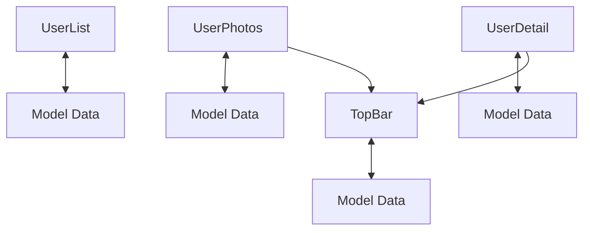
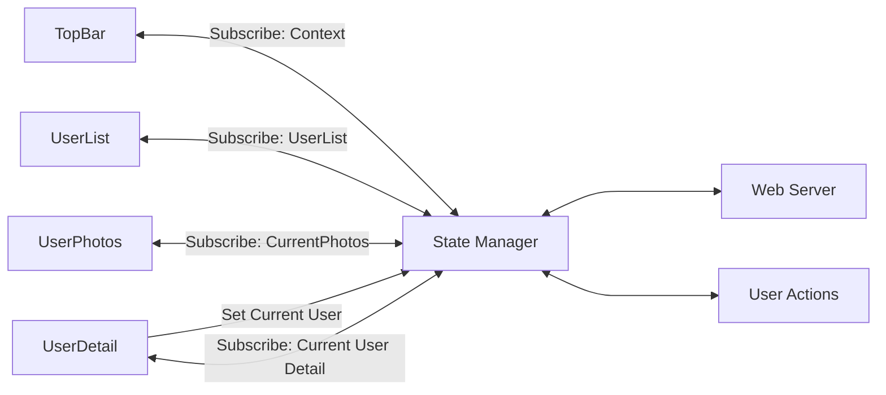
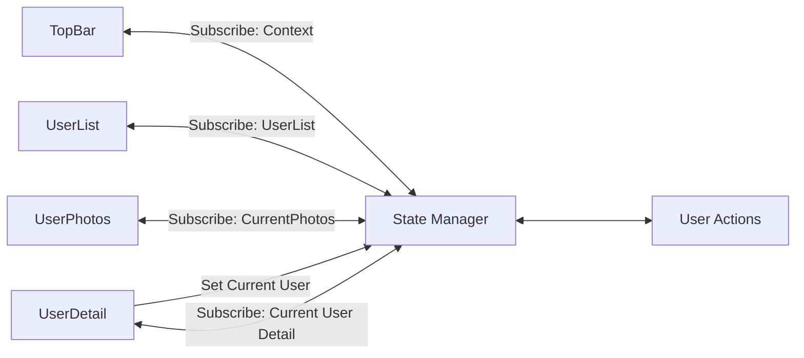

# State Management[^1]

## Our small, read-only photo app is deceptively simple

- Model, View, Controller - All setup on startup and static
  - Can have a nice modular design of view components.
  - Each MVC unit independently fetches their model data.
    - Some duplicate model data fetches (e.g. UserDetail & UserList)
- Add in Session State and object creation and updating 
  - Things get more complex for our single page app
- Examples:
  - User add new comments or photos - model data of one view changed by another view
  - Users logs out and logins into the app with a different login name - big change in model data

## Session state shared between frontend and backend

- Must be kept in sync between the browser app and the server 
  - Who, if anyone, is logged in?
- Server will need to reject any requests from users not logged in 
  - Model fetching done only at view/controller startup might not work
- Consider transitions of your photo app 
  - Login - Not logged in to logged in
    - At app startup most models are not available (e.g. sidenav user list) but become available after login is completed.
  - Logout - Logged in to not logged in
    - Requests to web server that worked before will now fail

## Models updates

- Consider what happens when new objects like users, photos, or comments
are added.
  - Models change
- Controller fetching model only at startup might not work
- Consider photo app adding a photo or comment
  - Model refresh needed

## Components are interested in outside events

- How to keep a modular design but allow controllers to be notified of things happening outside of it?
  - Example: a view component and an add component
- One option: Explicit communication interfaces in components 
  - ReactJS: Pass callback functions around to components

    ```html
    <Component commInfo={this.callMeWithInfo.bind(this)} /> 
    ```

- Better option: Listener/emitter pattern
  - Components registers interest (listen) and component detecting change signals (emit)

## React listener/emitter pattern: No opinion

- FLUX - Facebook's Application Architecture For Building user interfaces 
  - Store state in a "Store" - change with actions, notify view listeners

## Photo App current Model Data Handling



- Redux [https://redux.js.org/](https://redux.js.org/) - A predictable state container for JavaScript apps
- Relay [https://relay.dev/](https://relay.dev/) - The production-ready GraphQL client for React

## Photo App with state management



## Photo App with offline support



## Dealing with other model changes

What happens if another user adds a photo or comment?

### Options

1. Do nothing: Easy!
  - User won't see new material until they do something that caused the model to be refreshed
  - Very disconcerting if they don't see their own changes
2. Poll: Periodically check for changes or just refetch the model
  - Can provide a UI widget to trigger model refresh
3. Server push: Have the server push model changes as soon as they occur
  - User sees updates as soon as possible
  - Might conflict with user changes or be disconcerting for the user
  - Implementation is easier with Web Sockets

## ReactJS: Photo App with sessions and input

- App needs to track who (if anyone) is logged in
  - Ideally held in some state store
  - OK to keep in the PhotoShare component state (see [ReactJS Context](https://reactjs.org/docs/context.html) mechanism)
- Need to handle the no one logged-in case
  - Handling deep linking with React Router:

  ```js
  {
     this.userIsLoggedIn ?
       <Route path="/users/:id" component={UserDetail} />
     :
       <Redirect path="/users/:id" to="/login-register" />
  }
  ```

- Need to inform component with to refresh their models 
  - Again State management is ideal: OK to use callbacks

[^1]: [Stanford Computer Science](https://cs.stanford.edu)
