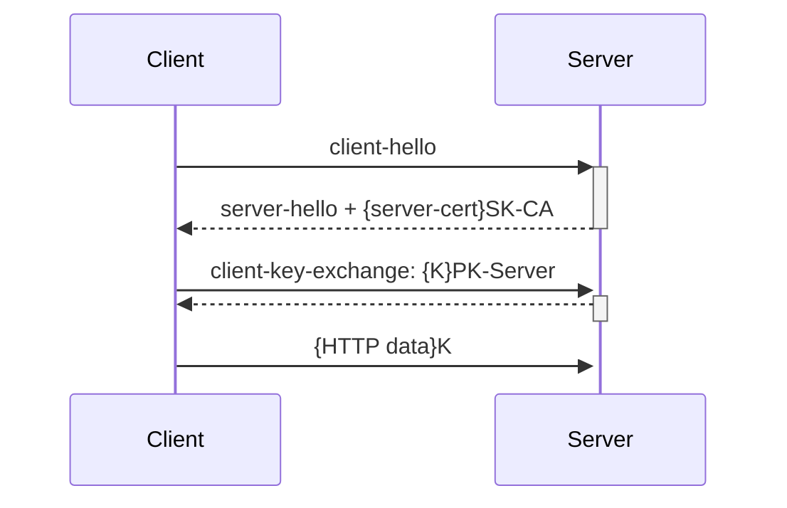

# Network/Session Attacks[^1]

# Network Attacks

- "man in the middle" threat model
- Attacker has access to network communication between browser and server
- Passive attacks:
  - Eavesdrop on network traffic
- Active attacks:
  - Inject network packets
  - Modify packets
  - Reorder, replay packets
  - Block packets

## Cryptography to the rescue
- Solution: use encryption to prevent eavesdropping and detect active attacks. 
  - Old idea: Scramble the information before transmitting it, unscramble when received
- Traditional encryption: keys guide scramble/unscramble
  - Symmetric keys (same key on both ends)
  - Key distribution problem: how can we exchange keys without meeting in person?
- Public-key encryption helps with the key distribution problem
  - Each principal (user, program, etc.) has two encryption keys, one public, one secret
  - Information encrypted with one can only be decrypted with the other.

    Encrypt with public key: Only principle can access 
    
    Encrypt with secret key: Know that it comes from principle
    
- Public-key encryption is slower than symmetric encryption
  - Use public-key to exchange symmetric key

## How to find the public key for a particular server?

Can't just ask it for its public key?  Don't know if the entity we're asking is really the server we want!

### Certificate authority

Well-known, trusted server that certifies public keys. 

### Certificate

A document encrypted with the secret key of a certificate authority

Identifies a particular service along with its public key

## Certificate authorities

- Certificate authorities establish selfs as well known services on Internet 
  - Browsers hard-wired to accept certificates from dozens of authorities
- Internet services compute keys, gives the public key to a certificate authority along with proof of identity
- Certificate authority returns a certificate for that service
- Service can pass along this certificate to browsers
  - Browser can validate the certificate came from the certification authority and see who the certification authority thinks the browser is talking to. 
- Trust: Browser trusts to certification authority

### Example

[apple](https://www.apple.com)

- lock to the left of url
- show certificate

## HTTPS 

Secure Sockets Layer (SSL) & Transport Layer Security (TLS)

- Protocol used for secure communication between browsers and servers
- Browser uses certificate to verify server's identity
- Only one way: SSL/TLS does not allow the server to verify browser identity
- Uses certificates and public-key encryption to pass a secret session-specific key from browser to server

### Overview



## Excuses for not using HTTPS for all Web traffic?

- Expensive: slows down web servers - more cycles per connection ○ Can now offload to networking hardware
- Breaks in-the-middle web page caching
- Today over 90% of HTTP traffic uses HTTPS
  - Industry moving to "HTTPS Everywhere"

## Problem: SSL stripping

- Common use pattern: user browses site with HTTP, upgrades to HTTPS for checkout.
- Active network attacker interposes on communication
- When server returns pages with HTTPS links, attacker changes them to HTTP.
- When browser follows those links, attacker intercepts requests, creates its own HTTPS connection to server, and forwards requests via that.
- As a result, the attacker sees all client packets (e.g., passwords).
- Browser provides feedback to user about whether HTTPS is in use, but most users won't notice the difference.

## Problem: Mixed content

- Main page loaded with HTTPS, but some internal content loaded via HTTP
(e.g. `<script src="http://.../script.js">`). 
  - Network attacker can modify content to attack page.
- Some browsers help to notify users:
  - IE7: displays dialog for user, doesn't show SSL lock.
  - Firefox: displays lock icon with "!"
  - Chrome: did show warning, now just shows same as HTTP
- Common developer error: over-specified URLs:

```html
<script src="http://www.site.com/library.js">
```
     
Instead, don't specify explicit protocols (or even site):

```html
<script src="/library.js">
```

## Problem: "Just in time" HTTPS

- Login page displayed with HTTP
  - Form posted with HTTPS
  - Appears secure but it isn't:
    - Active attack corrupts login page (send password someplace else during form post)
    - SSL stripping during form post: nothing indicates that the actual connection didn't use SSL
- Solution: before server returns HTML for login page, check for HTTPS; if page fetched via HTTP, redirect to the HTTPS version

## Problem: Bad certificate

- If a certificate is bad/unknown, browser issues warning dialog:
  - Most users can't understand, so they just click OK.
  - Some browsers warn repeatedly, but users will still just click through.
  - This enables various network attacks.

### Example

[Bad Certificate](https://wrong.host.badssl.com)

# Session Attacks

## Session State

- Session state is used to control access in web servers

```js
app.get(..., function (request, response) {
  if (request.session.login_name
```

- Typically derived from cookies in the request header

```
Cookie:connect.sid=s%3AckNzy0kByJYvsW5mR06ECGs1YXYojCXM.VvNg0rI3rguSElNZNtdGrMBrDvbW 4kvn641bqpcF4ec
Host: localhost:3000
```

- Consider what would happen if an attacker could guess or seal this cookie (Session Hijacking)

## Session Hijacking

- If an attacker can guess or steal the id associated with your session, he/she can impersonate you.
- Example: predictable session id
  - Server picks session id by incrementing a counter for each new session.
  - Attacker opens connection to server, gets session id.
  - Subtract 1 from session id: can hijack the previous session opened to the server.
- Solution: session ids must be unpredictable.
  - Don't build your own mechanism! Use something provided by your framework.
  - Rails: id = MD5(current time, random nonce)
  - Express Session: Uses module uid-safe - cryptographically secure UID (not predictable)

    Roll your own: `app.use(session({genid: function (request) { ....`

## Need to use HTTPS to protect cookies

- Even if session id chosen carefully, network attackers can read cookies from unencrypted connections
  - Sessions not using HTTPS inherently vulnerable to network attacks.
- HTTP/HTTPS upgrade problem:
  - Suppose session starts out with HTTP, converts to HTTPS after login
  - Network attacker could have read session id during HTTP portion of session
  - Once logging is complete, attacker can use the id to hijack the logged in session
- Change the session id after any change in privilege or security level

## Browser quirk involving cookies

- Cookies sent with all HTTP requests to our web server 
  - Even if our app is not the current one being shown!
- Sometime want this: Consider a deep-linking bookmark or the back button 
  - Desirable if it automatically picks up the session cookie
- Implication: Other sites/apps running concurrently can generate HTTP requests to our web servers!

## Cross-Site Request Forgery (CSRF)

- Attackers can potentially hijack sessions without even knowing session ids: 
  - Scenario:
    - Visit your bank's site, start up web app, log in.
    - Then visit the attacker's site (e.g. discussion forum with links, forms, etc.)
    - Attacker's page includes JavaScript that submits form to your bank.
    - When form gets submitted, browser includes bank's web app cookies, including the session id.
    - Bank transfers money to attacker's account.
    - The form can be in an iframe that is invisible, so you never know the attack occurred.
- This is called Cross-Site Request Forgery (CSRF) (Sea-surf)
  - Untrusted site uses trust that was given to user's browser

## CSRF Defences

- CSRF was a big issue when frameworks used form submission for input 
  - Ruby solution: server can mark forms that came from its pages
    - Every form must contain an additional authentication token as a hidden field
    - Server includes valid token in forms in pages that it generates (hidden form field).
    - Server checks token when form posted, rejects forms without proper token.
- JavaScript frameworks solutions
  - Don't accept POST submission directly from forms
    - Photo App: POST request have bodies of JSON strings
  - HTTP GET should not have side effects
    - Dangerous: Easy to trick the user into clicking on something
  - Have JavaScript include special HTTP request header property with secret 
    - Module csurf - Adds XSRF-TOKEN to request headers

## Web Application Trust Spheres

- Untrusted
  - Web Browser
  - HTTP
- Trusted
  - Web/App Server
  - Storage System
  - LAN

## Data Tampering

- Server sends information to browser (cookies, HTML with links & forms) 
  - Server can't trust what it gets back: User can view or modify anything provided by server 
  - Examples:
    - Session information in cookies
    - CSRF defence (hidden form fields)
- Option #1: Server only uses information as a hint (must validate and correct) 
  - Means we have a store all the information on server
- Option #2: Use cryptography to detect any tampering or forging 
  - Message Authentication Codes (MACs)  

## Message Authentication Codes (MACs)

- MAC function takes arbitrary-length text, secret key, produces a MAC that provides a unique signature for the text.

  Think: Cryptography secure checksum
  
- Without knowing the secret key, cannot generate a valid MAC.
- Server includes MAC with data sent to the browser.
- Browser must return both MAC and data.
- Server can check the MAC using its secret key to detect tampering. 

  Server checks input from browser and if MAC doesn't match tosses it (e.g. session cookie)

## Using MACs in web servers

- MACs are useful if we need:
  - Authentication - Know that we (the web server) authored the information
  - Integrity - Known that it wasn't tampered with
- Need encryption if we want **confidentiality**
- If we need all three: encrypt then MAC
- Crypto APIs exist for doing these but somewhat of a pain to use

[^1]: [Stanford Computer Science](https://cs.stanford.edu)
