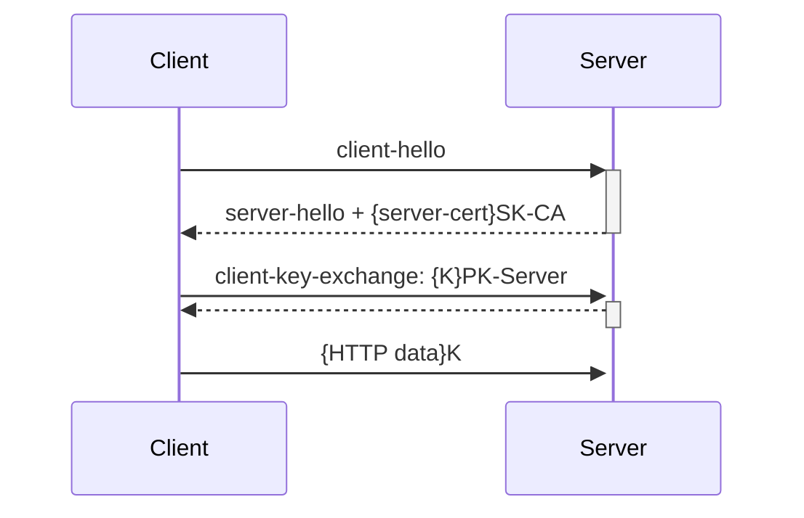

# Network/Session Attacks[^1]

# Network Attacks

- "man in the middle" threat model
- Attacker has access to network communication between browser and server
- Passive attacks:
  - Eavesdrop on network traffic
- Active attacks:
  - Inject network packets
  - Modify packets
  - Reorder, replay packets
  - Block packets

## Cryptography to the rescue
- Solution: use encryption to prevent eavesdropping and detect active attacks. 
  - Old idea: Scramble the information before transmitting it, unscramble when received
- Traditional encryption: keys guide scramble/unscramble
  - Symmetric keys (same key on both ends)
  - Key distribution problem: how can we exchange keys without meeting in person?
- Public-key encryption helps with the key distribution problem
  - Each principal (user, program, etc.) has two encryption keys, one public, one secret
  - Information encrypted with one can only be decrypted with the other.

    Encrypt with public key: Only principle can access 
    
    Encrypt with secret key: Know that it comes from principle
    
- Public-key encryption is slower than symmetric encryption
  - Use public-key to exchange symmetric key

## How to find the public key for a particular server?

Can't just ask it for its public key?  Don't know if the entity we're asking is really the server we want!

### Certificate authority

Well-known, trusted server that certifies public keys. 

### Certificate

A document encrypted with the secret key of a certificate authority

Identifies a particular service along with its public key

## Certificate authorities

- Certificate authorities establish selfs as well known services on Internet 
  - Browsers hard-wired to accept certificates from dozens of authorities
- Internet services compute keys, gives the public key to a certificate authority along with proof of identity
- Certificate authority returns a certificate for that service
- Service can pass along this certificate to browsers
  - Browser can validate the certificate came from the certification authority and see who the certification authority thinks the browser is talking to. 
- Trust: Browser trusts to certification authority

### Example

[apple](https://www.apple.com)

- lock to the left of url
- show certificate

## HTTPS 

Secure Sockets Layer (SSL) & Transport Layer Security (TLS)

- Protocol used for secure communication between browsers and servers
- Browser uses certificate to verify server's identity
- Only one way: SSL/TLS does not allow the server to verify browser identity
- Uses certificates and public-key encryption to pass a secret session-specific key from browser to server

### Overview



## Excuses for not using HTTPS for all Web traffic?

- Expensive: slows down web servers - more cycles per connection ○ Can now offload to networking hardware
- Breaks in-the-middle web page caching
- Today over 90% of HTTP traffic uses HTTPS
  - Industry moving to "HTTPS Everywhere"

## Problem: SSL stripping

- Common use pattern: user browses site with HTTP, upgrades to HTTPS for checkout.
- Active network attacker interposes on communication
- When server returns pages with HTTPS links, attacker changes them to HTTP.
- When browser follows those links, attacker intercepts requests, creates its own HTTPS connection to server, and forwards requests via that.
- As a result, the attacker sees all client packets (e.g., passwords).
- Browser provides feedback to user about whether HTTPS is in use, but most users won't notice the difference.

## Problem: Mixed content

- Main page loaded with HTTPS, but some internal content loaded via HTTP
(e.g. `<script src="http://.../script.js">`). 
  - Network attacker can modify content to attack page.
- Some browsers help to notify users:
  - IE7: displays dialog for user, doesn't show SSL lock.
  - Firefox: displays lock icon with "!"
  - Chrome: did show warning, now just shows same as HTTP
- Common developer error: over-specified URLs:

```html
<script src="http://www.site.com/library.js">
```
     
Instead, don't specify explicit protocols (or even site):

```html
<script src="/library.js">
```

## Problem: "Just in time" HTTPS

- Login page displayed with HTTP
  - Form posted with HTTPS
  - Appears secure but it isn't:
    - Active attack corrupts login page (send password someplace else during form post)
    - SSL stripping during form post: nothing indicates that the actual connection didn't use SSL
- Solution: before server returns HTML for login page, check for HTTPS; if page fetched via HTTP, redirect to the HTTPS version

## Problem: Bad certificate

- If a certificate is bad/unknown, browser issues warning dialog:
  - Most users can't understand, so they just click OK.
  - Some browsers warn repeatedly, but users will still just click through.
  - This enables various network attacks.

### Example

[Bad Certificate](https://wrong.host.badssl.com)

[^1]: [Stanford Computer Science](https://cs.stanford.edu)
